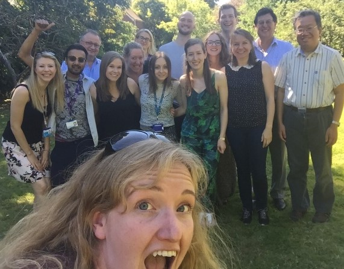

# Introducing the 2016 Mozilla Science Fellows: Kirstie Whitaker

Hello! My name is Kirstie and I'm a researcher in the [Department of Psychiatry](http://www.psychiatry.cam.ac.uk/) at the [University of Cambridge](https://www.cam.ac.uk/).

*A very exciting day when the Tour de France passed through Cambridge!*

I study adolescent brain development, which means I put teenagers and young adults in magnetic resonance imaging (MRI) scanners and take pictures of their brains.

*My brain: available on [figshare](https://dx.doi.org/10.6084/m9.figshare.879706.v1)*

Actually, that isn't true, I work in a large consortium of researchers and we have an amazing team of research assistants and radiographers who do the scanning!

*The incredible NSPN research assistants, and a selection of the many PhD students, postdocs and principle investigators....and me.*

You can analyse MRI data in lots of different ways. I'm particularly interested in the brain's structure. My co-authors - particularly Dr [Petra Vertes](http://www.neuroscience.cam.ac.uk/directory/profile.php?pv226) and Prof [Ed Bullmore](http://www.neuroscience.cam.ac.uk/directory/profile.php?etb23) - and I, recently published our findings that "[adolescence is associated with genomically patterned consolidation of the hubs of the human brain connectome](http://dx.doi.org/10.1073/pnas.1601745113)."

*A [pretty video](https://youtu.be/ztm2knaLBFc) I made to show off the network analyses we use in the [Brain Mapping Unit](http://www.bmu.psychiatry.cam.ac.uk/) in Cambridge.*

This work was conducted within the [Neuroscience in Psychiatry Network](http://www.nspn.org.uk/), a collaboration between the University of Cambridge and [University College London](https://www.ucl.ac.uk/). We're interested in understanding adolescent brain development, particularly in the context that so many young people experience their first episodes of depression or psychosis during their teenage years.

We've collected a large number of MRI scans from our amazing volunteer participants. ***My primary goal for the next ten months as a Mozilla science fellow is to package, document and release that data for everyone to use.***

We're smart cookies here at the University of Cambridge, but we don't have all the ideas, we don't have all the answers, and we certainly don't have all the time we need to undertake the ones we have!

We've spent four years and a few million pounds on collecting, curating and analysing the MRI scans of 300 young people. We're funded by the [Wellcome Trust](https://wellcome.ac.uk/) whose mandate is *"to improve health for everyone by helping great ideas to thrive"*. They're really leading the way in ensuring everyone has open access to all the output from research studies, and I'm so excited to share our fantastic data with the wider scientific community.

**We're better scientists when we work together.**

My second goal for my Mozilla fellowship year is to ***release my code as a python package***.

I write [a lot of code](https://github.com/KirstieJane) and I have done for years, but it's only in the last year (with the support, mentorship and encouragement of the Mozilla Science Lab team) that I've promoted my code and contributed to other FOSS (free and open source software) projects.

The main reason is [imposter syndrome](https://en.wikipedia.org/wiki/Impostor_syndrome). I didn't learn any coding in my undergrad or masters, I'm completely self taught. I've never taken an (official) class in how to code and I always assumed that my code was rubbish and everyone else's was amazing.

I'm here from the future to tell you that is **completely not true**. My code is actually very good, or at least good enough: It works and other people can use it! Boom! Done! [Ship it](https://www.quora.com/GitHub-What-is-the-significance-of-the-Ship-It-squirrel).

*Picture from: [www.quora.com/GitHub-What-is-the-significance-of-the-Ship-It-squirrel](https://www.quora.com/GitHub-What-is-the-significance-of-the-Ship-It-squirrel)*

(Which I did - yay! You can find all the analysis and visualisation code for our [recent paper](http://dx.doi.org/10.1073/pnas.1601745113) on [GitHub](https://github.com/KirstieJane/NSPN_WhitakerVertes_PNAS2016/). Check it out!)

Given my own experiences with imposter syndrome and the support and mentorship I've recieved over the last few years, I'm so passionate about helping people overcome their self doubts. That's why my third goal is to ***bring 10 people into the Mozilla Science Lab community as active members***.

As a member of the [Open Leaders Cohort](https://science.mozilla.org/blog/wow-introducing-working-open-workshops-and-the-open-leaders-cohort) I built the [STEMM Role Models](http://www.stemmrolemodels.com) project which aims to *inspire future generations by providing the most exciting and diverse speakers for your conference*. It's openly developed on [GitHub](https://github.com/KirstieJane/STEMMRoleModels) and you'll hear me talk more about it on the [Mozilla Learning](https://learning.mozilla.org/en-US/) and Mozilla Science [joint community call](https://science.mozilla.org/programs/events/community-call-oct-13-11-et) on Thursday 13th October when we to celebrate [Ada Lovelace Day](http://findingada.com/) and women around the globe who work in Science, Technology, Engineering, Maths and Medicine!

*The [STEMM Role Models](http://www.stemmrolemodels.com) project is a database of researchers from traditionally under-represented groups such as women, people of colour, LGBTQ community members and people with a disability.*

**I know others will benefit from mentorship and networking within the Mozilla community just as much as I have, and I want to make that happen.**

So please get in touch. I'm looking forward to meeting you!

* Website: [www.kirstiewhitaker.com](https://kirstiewhitaker.com/)
* Twitter: [@kirstie_j](https://twitter.com/kirstie_j)
* GitHub: [@KirstieJane](https://github.com/KirstieJane)
* STEMM Role Models: [website](http://www.stemmrolemodels.com) & [GitHub repo](https://github.com/KirstieJane/STEMMRoleModels)
* Ada Lovelace themed community call: [Oct 13th 11EDT](https://science.mozilla.org/programs/events/community-call-oct-13-11-et)
