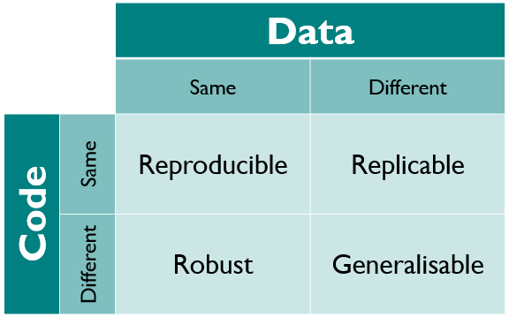

# Kirstie Zine plan

8 pages

1. cover - "what is generalisable research and why do we need it?"
2. current scientific pipeline
3. *reproducible* research & what could be better
4. *replication* - why we need to do it
5. example of why studies won't always replicate (and why that's fine but important to know!)
6. *robust* research - different ways of skinning the same cat
7. *generalisable* - bringing it all together and making it helpful for policy makers and clinicians
8. back cover - table w title "handy dandy reference"

## Pictures, references, resources

#### Page 1 - cover

* What is generalisable research and why do we need it?!

* **NEED IMAGE**

#### Page 2 - current scientific pipeline

* At the moment scientists do a whole bunch of work and then write a paper to explain what they found.
* Most of the time they don't include the data they used or detailed instructions to recreate their method.
* So there's no way to check what they did!

* https://electroncafe.wordpress.com/2011/05/04/scientific-process-rage/

* https://www.ted.com/talks/uri_alon_why_truly_innovative_science_demands_a_leap_into_the_unknown

* http://www.byrdseed.com/success-isnt-a-straight-line/
* https://www.amazon.com/dp/0446539694/?tag=byrdseed-20

#### Page 3 - reproducible research

* It would be better if we provided the data and the code to *REPRODUCE* what they've done.

* **JARGON BUSTIN': Reproducible means results can be replicated by a different person using exactly the same data and analysis steps.**

* http://science.sciencemag.org/content/334/6060/1226

* A statistical definition for reproducibility and replicability http://dx.doi.org/10.1101/066803

#### Page 4 - replicated research

* If the result from a study is really cool, we want to **REPLICATE** those findings with a different set of data.

* We need this to know whether these results hold in lots of different people, or just in the cohort from the same study.

**JARGON BUSTIN': Replication means you conclude the same message when you use the original study's analysis code on a different data set.**

* Reproducibility project: Psychology https://osf.io/ezcuj/wiki/home/
  * Irritatingly the "wrong" word - this was actually a huge replication study
  * Also in Cancer: https://osf.io/e81xl/wiki/home/

* http://science.sciencemag.org/content/349/6251/aac4716

#### Page 5 - examples of why some studies won't work

* It doesn't matter whether results replicate or not, what is important is that we know the answer so we can have the most complete understanding of our research question.

  * (People aren't necessarily doing something wrong if their original results don't replicate.)

* For example, imagine you ask the same question of people in a wine bar and in a sports bar.
    * NEED A QUESTION!!
  * Its not difficult to see that you might get different results when you ask different people.
  * It doesn't mean either of your studies are wrong, but it does mean that we have to be more careful about what we conclude.

* Blindsight
  * Avoiding unseen obstacles: Subcortical vision is not sufficient to maintain normal obstacle avoidance behaviour during reaching  http://www.sciencedirect.com/science/article/pii/S001094521630257X
  * Human blindsight is mediated by an intact geniculo-extrastriate pathway https://elifesciences.org/content/4/e08935

#### Page 6 - Robust research

* There are lots of different ways to analyse data. so we need to know if our results are ROBUST to the decisions we make along the way.

**JARGON BUSTIN: Research is robust if you conclude the same message after applying a variety of different methods to analyses one data set.**

* "More than one way to skin a cat"
* http://fyeahhairlesscats.tumblr.com/

* If the results work only for one type of analysis, that's fine, but we need to dig into what makes that analysis different to the others to better understand our result.

#### Page 7 - Generalisable research

* Policy makers and clinicians need to know if results can GENERALISE to a wider population.

* **JARGON BUSTIN: Research is generalisable if you conclude the same message after applying a variety of analysis methods to different data sets.**

#### Page 8 - Back cover

* Your handy dandy guide on your journey to find generalisable research

